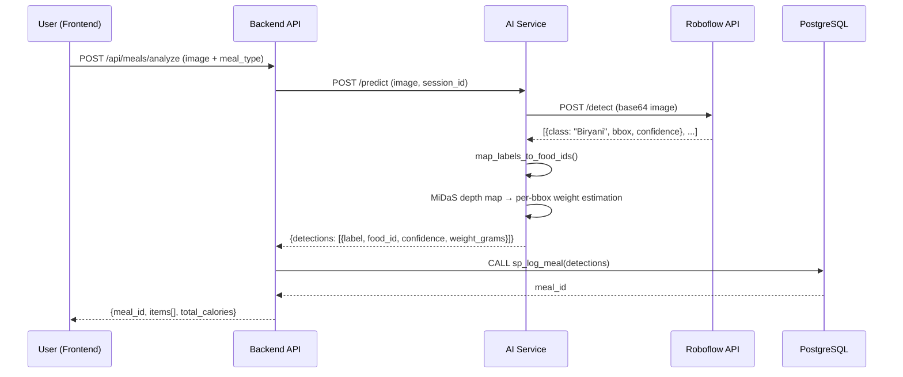

# ADR-009: CV Pipeline — Roboflow IndianFoodNet + MiDaS Depth-Enhanced Weight Estimation

**Status:** Accepted  
**Date:** 2026-10-08  
**Authors:** Arush Mehta  

---

## Context

NutriVision AI needs a computer vision pipeline that:
1. **Identifies food items** in a photograph (classification/detection)
2. **Estimates portion weight** in grams for nutrition calculation

We evaluated building a custom model but the timeline is too tight. We need something that works end-to-end today with the architecture we already have.

## Decision

We will use a **two-stage pipeline**:

| Stage | Tool | Role |
|---|---|---|
| **Stage 1 — Detection** | [Roboflow IndianFoodNet](https://universe.roboflow.com/indianfoodnet/indianfoodnet) (hosted inference API) | Detect food items + bounding boxes from a photo |
| **Stage 2 — Weight Estimation** | MiDaS DPT_Hybrid (local, already deployed) | Produce a relative depth map, compute per-detection volume scores, scale base weights |

### Why Not a Custom Model?

- No training time available (hackathon deadline)
- IndianFoodNet already covers 30 common Indian dishes with ~5,500 training images
- Roboflow's hosted API requires zero GPU infrastructure — just an API key

### Why Not Depth Alone?

MiDaS produces **relative** depth (unitless), not absolute measurements. It cannot tell you "this pile of rice is 3cm tall." But it *can* tell you "this pile is 40% taller than average," which is enough to scale a known base weight up or down.

---

## Architecture

### Current State (Mock)

```
POST /predict (image)
  └─→ Hardcoded: [{label: "rice", food_id: 12}, {label: "dal", food_id: 34}]
       └─→ MiDaS depth → scale base weights → return detections[]
```

### Target State (Real)

```
POST /predict (image)
  │
  ├─ Step 1: Roboflow API call
  │    POST https://detect.roboflow.com/indianfoodnet/1
  │    Body: base64 image + API key
  │    Returns: [{class: "Biryani", bbox: {x,y,w,h}, confidence: 0.91}, ...]
  │
  ├─ Step 2: Label → food_id mapping
  │    "Biryani" → fuzzy match against food_items.name → food_id: 42
  │    Uses a static lookup dict + fallback Levenshtein search
  │
  ├─ Step 3: MiDaS depth-enhanced weight estimation (PER bounding box)
  │    For each detection:
  │      1. Crop depth map to bounding box region
  │      2. Compute median depth within the crop
  │      3. Subtract plate-surface depth (estimated as image-edge median)
  │      4. relative_height = food_depth - plate_depth
  │      5. volume_score = bbox_area_fraction × relative_height
  │      6. weight_grams = BASE_WEIGHT[label] × (1 + scale_factor × volume_score)
  │      7. Clamp to [MIN_WEIGHT, MAX_WEIGHT]
  │
  └─ Step 4: Return detections[]
       [{detected_label, matched_food_id, confidence, suggested_weight_grams}, ...]
```

---

## Files to Modify

### `ai-service/src/app.py` — `/predict` endpoint

**Replace** the hardcoded `mocked_detections` block with:

1. A call to `roboflow_detect(image_bytes)` → returns raw Roboflow predictions
2. A call to `map_labels_to_food_ids(predictions)` → maps class names to DB food_ids
3. Pass the mapped detections to existing `estimate_weights()` (already wired)

The response schema (`PredictResponse`) stays **exactly the same**. The backend (`mealController.ts`) doesn't need any changes — it already consumes `detections[]`.

### `ai-service/src/depth.py` — `estimate_weights()`

**Enhance** to accept optional bounding boxes and use per-region depth instead of center-40%:

- Current: computes median depth over center 40% of entire image (global)
- Target: if bounding boxes are provided, compute median depth **per bbox region**
- This makes the weight estimation **per-item** instead of global

**Expand `BASE_WEIGHTS` dict** to cover all 30 IndianFoodNet classes:

```python
BASE_WEIGHTS = {
    "aloogobi": 180.0,
    "aloomasala": 180.0,
    "bhatura": 100.0,
    "bhindimasala": 150.0,
    "biryani": 250.0,
    "chai": 200.0,      # ml, treated as grams
    "chole": 180.0,
    "coconutchutney": 50.0,
    "dal": 120.0,
    "dosa": 100.0,
    "dumaloo": 180.0,
    "fishcurry": 200.0,
    "ghevar": 100.0,
    "greenchutney": 50.0,
    "gulabjamun": 80.0,
    "idli": 80.0,
    "jalebi": 80.0,
    "kebab": 150.0,
    "kheer": 150.0,
    "kulfi": 100.0,
    "modak": 60.0,
    "pavbhaji": 250.0,
    "samosa": 80.0,
    "toordal": 120.0,
    # ... extend as needed
    # fallback
    "rice": 150.0,
    "chicken": 150.0,
    "paneer": 100.0,
    "roti": 60.0,
}
```

### `ai-service/src/roboflow_client.py` — NEW FILE

Thin wrapper around the Roboflow hosted inference API:

```
roboflow_detect(image_bytes) → List[{class, confidence, bbox}]
```

- Env var: `ROBOFLOW_API_KEY`
- Env var: `ROBOFLOW_MODEL_ID` (default: `indianfoodnet/1`)
- Timeout: 10s
- Graceful fallback: if Roboflow is down, return empty detections (let user add food manually)

### `ai-service/src/food_mapper.py` — NEW FILE

Maps Roboflow class labels to `food_items.food_id` in the database:

1. **Static dict** — hardcoded mapping of all 30 IndianFoodNet classes to known food_ids
2. **Fuzzy fallback** — if label isn't in the dict, normalize it (`"AlooGobi"` → `"aloo gobi"`) and search `food_items.name` via `ILIKE` or Levenshtein
3. Returns `matched_food_id` or `None` if no match

---

## Environment Variables (New)

| Variable | Value | Where |
|---|---|---|
| `ROBOFLOW_API_KEY` | (your key from roboflow.com/settings) | `ai-service/.env`, `docker-compose.yml` |
| `ROBOFLOW_MODEL_ID` | `indianfoodnet/1` | `ai-service/.env` |

---

## What Does NOT Change

| Component | Why |
|---|---|
| `mealController.ts` | Already consumes `detections[]` — schema is identical |
| `sp_log_meal` stored procedure | Already processes `detections JSONB` array |
| `depth.py` core MiDaS loading | Model loading stays the same, only `estimate_weights()` gets enhanced |
| Frontend `LogMeal.tsx` | Already sends image + receives detections — no UI changes needed |
| Database schema | No new tables or columns |

---

## Accuracy Expectations

> **This is not a precision instrument. It's a convincing, technically sound demo.**

| Metric | Realistic Expectation |
|---|---|
| **Food detection accuracy** | ~75-85% on clean, well-lit photos of common Indian dishes |
| **Weight estimation accuracy** | ±30-50% (heuristic, not calibrated) |
| **End-to-end calorie accuracy** | Rough ballpark — users should correct via the manual adjustment flow |

The manual correction flow (`correctMealItem`) and the `ai_match_log` table exist precisely to handle this. Over time, correction data could retrain better models.

---

## Sequence Diagram



---

## Rollback Plan

If Roboflow is unavailable or the API key expires during the demo:

1. `roboflow_detect()` catches the error and returns `[]`
2. `/predict` falls back to empty detections
3. User sees "No items detected" and can add food manually via search
4. The app remains fully functional — just without auto-detection

This is identical to the current mock behavior but without the hardcoded rice+dal.
