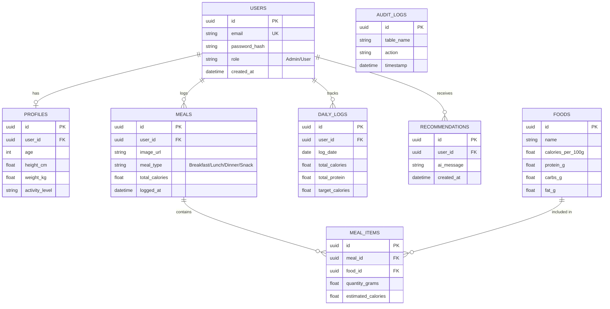

# ⚠️ DEPRECATED — Do Not Use for Implementation

This file has been superseded by **[03_01_Canonical_Data_Model.md](./03_Data/03_01_Canonical_Data_Model.md)**.

It is retained only for historical reference. All Builders must use the canonical model. Key differences:
- This file incorrectly includes `password_hash` on `Users` (contradicts ADR-003: Google OAuth only).
- This file uses a flat `FOODS` table. The canonical model uses the normalized `food_items` + `food_nutrients` structure.
- This file does not include staging tables, `ai_match_log`, `food_sources`, or `food_categories`.

---

## Entity Relationship (ER) Diagram

## Compliance Checklist (Based on PDF)
- [x] **Relational DB**: PostgreSQL.
- [x] **Primary Entities**: Users, Meals, Foods, Logs (4+ entities).
- [x] **Relationships**: 1:1, 1:N, M:N resolved via `MealItems` (3+ relationships).
- [x] **8 Tables Minimum**: Users, Profiles, Foods, Meals, MealItems, DailyLogs, Recommendations, AuditLogs.
- [x] **Single User Table**: `Users` uses `role` column (no separate Admin/Student tables).
- [x] **Normalization**: 3NF applied. M:N relationship between Meals and Foods is broken down by the `MealItems` junction table.
- [x] **Advanced Features Planned**: `AuditLogs` will be populated using an SQL **Trigger**, fulfilling the trigger requirement.
