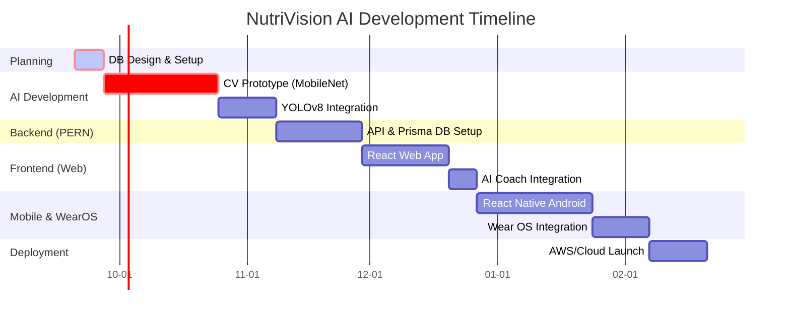

# Implementation Plan & Roadmap 🗺️

This roadmap sequences development to prove the high-risk AI features first, followed by the backend, and eventually the client applications. 

## Project Timeline (Gantt Chart)

## Phase 1: Planning, Environment & DB Design (Week 1)
*   **Goal**: Set up the environment and finalize the relational database schema.
*   **Tasks**:
    *   Initialize Git repository (2 branches: `main`, `dev` as per PDF).
    *   Setup PostgreSQL database.
    *   Finalize ER Diagram and Data Dictionary.
    *   Set up Node.js/Express environment with Prisma ORM.

## Phase 2: Computer Vision Prototype (Weeks 2-5)
*   **Goal**: Prove the AI can classify single food items.
*   **Tasks**:
    *   Curate a dataset of ~10 common foods (Rice, Dal, Paneer, Chicken, Roti, etc.).
    *   Train a lightweight `MobileNetV3` model using PyTorch.
    *   Write a simple Python script to test predictions (`accuracy > 80%`).

## Phase 3: Multi-Food Detection (Weeks 6-8)
*   **Goal**: Detect multiple items on a single plate.
*   **Tasks**:
    *   Transition to `YOLOv8` for object detection/bounding boxes.
    *   Output detections in JSON format (e.g., `{"foods": ["rice", "dal"]}`).
    *   Wrap the model in a Python `FastAPI` microservice.

## Phase 4: Backend API & Database Implementation (Weeks 9-11)
*   **Goal**: Build the core Node.js backend meeting university criteria.
*   **Tasks**:
    *   Implement Prisma ORM connecting to PostgreSQL.
    *   Create Auth endpoints (Google OAuth / JWT, BCrypt for passwords).
    *   Build CRUD operations for Meals, Users, and Goals.
    *   Implement at least one Stored Procedure and Trigger (PDF requirement).

## Phase 5: React Web Application (Weeks 12-14)
*   **Goal**: Build the user-facing web dashboard.
*   **Tasks**:
    *   Setup React, Tailwind CSS, and Recharts.
    *   Build Login, Dashboard, Meal Upload, and History pages.
    *   Integrate API to show macro-nutrient graphs.

## Phase 6: AI Nutrition Coach (Week 15)
*   **Goal**: Add the "Explain My Plate" and feedback system.
*   **Tasks**:
    *   Integrate an LLM (e.g., OpenAI or Gemini API) into the Node backend.
    *   Feed the user's weekly metrics into the prompt to generate personalized advice.

## Phase 7: React Native & Wear OS (Weeks 16-20)
*   **Goal**: Bring the app to mobile and smartwatches.
*   **Tasks**:
    *   Build the Android App using React Native (reuse API).
    *   Implement camera functionality for easy meal scanning.
    *   Integrate Google Fit API for steps/calories burned.
    *   Build Wear OS companion app displaying daily remaining calories.

## Phase 8: Deployment & CI/CD (Weeks 21-22)
*   **Goal**: Launch to the cloud.
*   **Tasks**:
    *   Deploy Database to a managed service (e.g., Supabase, Aiven).
    *   Deploy Node Backend & AI FastAPI (Railway or Render).
    *   Deploy React Web (Vercel).
    *   Set up GitHub Actions for CI/CD pipeline (Bonus marks).
